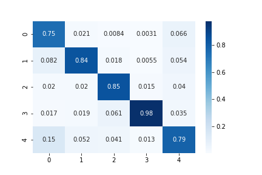

# Cassava-Leaf-Disease-Classification

## Score

| Train          | Inference          | Model                               | Public LB | CV          | Comment                                              |
| ---            | ---                | ---                                 | ---       | ---         | ---                                                  |
| [resnext-v1]   | [resnext-inf-v1]   | resnext50_32x4d                     | 0.894     | 0.89069     | -                                                    |
| [efficient-v1] | [efficient-inf-v1] | efficientnet_b4_ns                  | 0.900     | 0.89103     | CutMix, freeze batch normalization                   |
| same           | [efficient-inf-v2] | efficientnet_b4_ns                  | 0.898     | same        | TTA x10                                              |
| same           | [efficient-inf-v5] | efficientnet_b4_ns                  | **0.901** | same        | TTA x7                                               |
| -              | [ensemble-v1]      | resnext50_32x4d, efficientnet_b4_ns | 0.894     | -           | -                                                    |
| [efficient-v2] | [efficient-inf-v3] | efficientnet_b4_ns                  | 0.897     | 0.88814     | gradient accumulation, CosineAnnealingWarmupRestarts |
| [efficient-v3] | [efficient-inf-v4] | efficientnet_b4_ns                  | 0.898     | 0.89137     | MixUp                                                |
| [vt-v1]        | [vt-inf-v1]        | vit_base_patch16_384                | 0.897     | 0.88958     | based on [efficient-v3]                              |
| [deit-v1]      | [deit-inf-v1]      | deit_base_patch16_384               | 0.895     | 0.89019     | based on [efficient-v1]                              |
| [efnet-b3-v1]  | [efnet-b3-inf-v1]  | tf_efficientnet_b3_ns               | 0.895     | 0.89255     | based on [deit-v1], batch update, increase min lr    |
| [seres-v1]     | [seres-inf-v1]     | seresnext50_32x4d                   |           | **0.89422** | based on [efnet-b3-v1], MixUp                        |

## Validation

### [efficient-v1]



```
              precision    recall  f1-score   support

           0       0.74      0.75      0.74      1087
           1       0.88      0.84      0.86      2189
           2       0.87      0.85      0.86      2386
           3       0.96      0.98      0.97     13158
           4       0.80      0.79      0.79      2577

    accuracy                           0.91     21397
   macro avg       0.85      0.84      0.85     21397
weighted avg       0.91      0.91      0.91     21397
```

### [efnet-b3-v1]


```
              precision    recall  f1-score   support

           0       0.83      0.80      0.82      1087
           1       0.92      0.88      0.90      2189
           2       0.90      0.89      0.90      2386
           3       0.97      0.99      0.98     13158
           4       0.86      0.85      0.86      2577

    accuracy                           0.94     21397
   macro avg       0.90      0.88      0.89     21397
weighted avg       0.94      0.94      0.94     21397
```


[deit-inf-v1]: https://github.com/IMOKURI/Cassava-Leaf-Disease-Classification/commit/22ca4772148d269eac8494df463c5e9eeb03301f
[deit-v1]: https://github.com/IMOKURI/Cassava-Leaf-Disease-Classification/commit/9181ff1cb82f62d6cafffc331b49920194544d32
[efficient-inf-v1]: https://github.com/IMOKURI/Cassava-Leaf-Disease-Classification/commit/bc1bc571b52a0d3b5ec6e739fc5bc5e598c26c62
[efficient-inf-v2]: https://github.com/IMOKURI/Cassava-Leaf-Disease-Classification/commit/05454a2cb7f7ffac5680cd3c69421b7a81e72e77
[efficient-inf-v3]: https://github.com/IMOKURI/Cassava-Leaf-Disease-Classification/commit/81633875dcaa68399b8b7e86e248a86758a0706a
[efficient-inf-v4]: https://github.com/IMOKURI/Cassava-Leaf-Disease-Classification/commit/00c07dacea90e16672c3b9603ea666036722d1da
[efficient-inf-v5]: https://github.com/IMOKURI/Cassava-Leaf-Disease-Classification/commit/e76954bd1a71d081f1653edddf4336a1dc5c589f
[efficient-v1]: https://github.com/imokuri/cassava-leaf-disease-classification/commit/f639150116370039666b7bab452abd85932f4d24
[efficient-v2]: https://github.com/IMOKURI/Cassava-Leaf-Disease-Classification/commit/d19c4c26aaacc5f6c1e08d91821939f6d9c1e5d8
[efficient-v3]: https://github.com/IMOKURI/Cassava-Leaf-Disease-Classification/commit/36ce5d1f60d7e42a7d8e60d54f32d5884ebff23c
[efnet-b3-inf-v1]: https://github.com/IMOKURI/Cassava-Leaf-Disease-Classification/commit/f60bb3c9f57326a8cbf0986583c167cc6d8d66f6
[efnet-b3-v1]: https://github.com/IMOKURI/Cassava-Leaf-Disease-Classification/commit/83189c1f6e6b651f4f3a140cf59b2987905932b9
[ensemble-v1]: https://github.com/IMOKURI/Cassava-Leaf-Disease-Classification/commit/2add41e660eafaac35f87a4f506a5314383c9cba
[resnext-inf-v1]: https://github.com/IMOKURI/Cassava-Leaf-Disease-Classification/commit/8fa6fe163d8e90cad183bc44d52e6e430510e5a8
[resnext-v1]: https://github.com/imokuri/cassava-leaf-disease-classification/commit/df110ca08bcbd3a69e45ffda3f33154bfde7fc12
[seres-v1]: https://github.com/IMOKURI/Cassava-Leaf-Disease-Classification/commit/448848da662d9f7347b39439fb0af771ff019fd7
[vt-inf-v1]: https://github.com/IMOKURI/Cassava-Leaf-Disease-Classification/commit/4db1fb6173ab934c18b9d1ccdaefe1632d71e35a
[vt-v1]: https://github.com/IMOKURI/Cassava-Leaf-Disease-Classification/commit/e8bf753d3424c663a98679eb4016c538df819624
