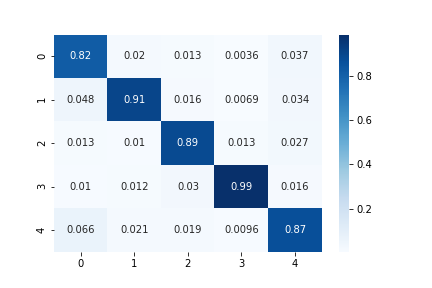
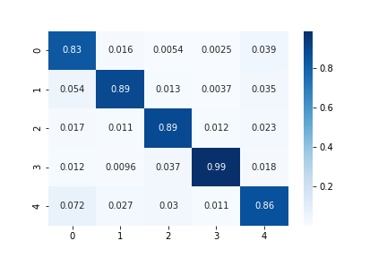

# Cassava-Leaf-Disease-Classification

## Score

### Single Model

| Train          | Inference          | Model                 | Public LB | CV          | Comment                                              |
| ---            | ---                | ---                   | ---       | ---         | ---                                                  |
| [resnext-v1]   | [resnext-inf-v1]   | resnext50_32x4d       | 0.894     | 0.89069     | -                                                    |
| [efficient-v1] | [efficient-inf-v1] | efficientnet_b4_ns    | **0.900** | 0.89103     | CutMix, freeze batch normalization                   |
| [efficient-v2] | [efficient-inf-v3] | efficientnet_b4_ns    | 0.897     | 0.88814     | gradient accumulation, CosineAnnealingWarmupRestarts |
| [efficient-v3] | [efficient-inf-v4] | efficientnet_b4_ns    | 0.898     | 0.89137     | MixUp                                                |
| [vt-v1]        | [vt-inf-v1]        | vit_base_patch16_384  | 0.897     | 0.88958     | based on [efficient-v3]                              |
| [deit-v1]      | [deit-inf-v1]      | deit_base_patch16_384 | 0.895     | 0.89019     | based on [efficient-v1]                              |
| [efnet-b3-v1]  | [efnet-b3-inf-v1]  | tf_efficientnet_b3_ns | 0.895     | 0.89255     | based on [deit-v1], batch update, increase min lr    |
| [seres-v1]     | [seres-inf-v1]     | seresnext50_32x4d     | **0.900** | 0.89422     | based on [efnet-b3-v1], MixUp                        |
| [seres-v2]     | [seres-inf-v3]     | seresnext50_32x4d     | 0.899     | **0.89532** | label smoothing                                      |
| [vt-v2]        | [vt-inf-v2]        | vit_base_patch16_384  | 0.899     | 0.89220     | label smoothing, freeze BN, etc                      |

### TTA

| Train          | Inference          | Model              | Public LB | CV  | Comment       |
| ---            | ---                | ---                | ---       | --- | ---           |
| [efficient-v1] | [efficient-inf-v2] | efficientnet_b4_ns | 0.898     | -   | TTA x10       |
| [efficient-v1] | [efficient-inf-v5] | efficientnet_b4_ns | 0.901     | -   | TTA x7        |
| [seres-v1]     | [seres-inf-v2]     | seresnext50_32x4d  | 0.900     | -   | TTA x7 (flip) |


### Ensemble

| Train | Inference     | Model                                                       | Public LB | CV  | Comment                                         |
| ---   | ---           | ---                                                         | ---       | --- | ---                                             |
| -     | [ensemble-v2] | seresnext50_32x4d                                           | **0.903** | -   | [seres-v1], [seres-v2]                          |
| -     | [ensemble-v3] | efficientnet_b4_ns, seresnext50_32x4d                       | **0.903** | -   | [efficient-v1], [seres-v1], [seres-v2]          |
| -     | [ensemble-v4] | efficientnet_b4_ns, seresnext50_32x4d                       | 0.902     | -   | [efficient-v1], [seres-v1]                      |
| -     | [ensemble-v5] | efficientnet_b4_ns, seresnext50_32x4d, vit_base_patch16_384 |           | -   | [efficient-v1], [seres-v1], [seres-v2], [vt-v2] |


## Validation

### [efficient-v1]


```
              precision    recall  f1-score   support

           0       0.74      0.75      0.74      1087
           1       0.88      0.84      0.86      2189
           2       0.87      0.85      0.86      2386
           3       0.96      0.98      0.97     13158
           4       0.80      0.79      0.79      2577

    accuracy                           0.91     21397
   macro avg       0.85      0.84      0.85     21397
weighted avg       0.91      0.91      0.91     21397
```

### [efnet-b3-v1]


```
              precision    recall  f1-score   support

           0       0.83      0.80      0.82      1087
           1       0.92      0.88      0.90      2189
           2       0.90      0.89      0.90      2386
           3       0.97      0.99      0.98     13158
           4       0.86      0.85      0.86      2577

    accuracy                           0.94     21397
   macro avg       0.90      0.88      0.89     21397
weighted avg       0.94      0.94      0.94     21397
```

### [vt-v1]


```
              precision    recall  f1-score   support

           0       0.80      0.80      0.80      1087
           1       0.90      0.88      0.89      2189
           2       0.90      0.85      0.87      2386
           3       0.97      0.98      0.97     13158
           4       0.85      0.82      0.84      2577

    accuracy                           0.93     21397
   macro avg       0.88      0.87      0.88     21397
weighted avg       0.93      0.93      0.93     21397
```

### [seres-v1]



```
              precision    recall  f1-score   support

           0       0.84      0.82      0.83      1087
           1       0.93      0.89      0.91      2189
           2       0.91      0.89      0.90      2386
           3       0.97      0.99      0.98     13158
           4       0.87      0.86      0.87      2577

    accuracy                           0.94     21397
   macro avg       0.91      0.89      0.90     21397
weighted avg       0.94      0.94      0.94     21397
```

### [seres-v2]


```
              precision    recall  f1-score   support

           0       0.84      0.84      0.84      1087
           1       0.93      0.89      0.91      2189
           2       0.91      0.89      0.90      2386
           3       0.97      0.99      0.98     13158
           4       0.89      0.86      0.87      2577

    accuracy                           0.94     21397
   macro avg       0.91      0.89      0.90     21397
weighted avg       0.94      0.94      0.94     21397
```

### [ensemble-v2]



```
              precision    recall  f1-score   support

           0       0.84      0.83      0.84      1087
           1       0.93      0.89      0.91      2189
           2       0.91      0.89      0.90      2386
           3       0.97      0.99      0.98     13158
           4       0.88      0.86      0.87      2577

    accuracy                           0.94     21397
   macro avg       0.91      0.89      0.90     21397
weighted avg       0.94      0.94      0.94     21397

```


[deit-inf-v1]: https://github.com/IMOKURI/Cassava-Leaf-Disease-Classification/commit/22ca4772148d269eac8494df463c5e9eeb03301f
[deit-v1]: https://github.com/IMOKURI/Cassava-Leaf-Disease-Classification/commit/9181ff1cb82f62d6cafffc331b49920194544d32
[efficient-inf-v1]: https://github.com/IMOKURI/Cassava-Leaf-Disease-Classification/commit/bc1bc571b52a0d3b5ec6e739fc5bc5e598c26c62
[efficient-inf-v2]: https://github.com/IMOKURI/Cassava-Leaf-Disease-Classification/commit/05454a2cb7f7ffac5680cd3c69421b7a81e72e77
[efficient-inf-v3]: https://github.com/IMOKURI/Cassava-Leaf-Disease-Classification/commit/81633875dcaa68399b8b7e86e248a86758a0706a
[efficient-inf-v4]: https://github.com/IMOKURI/Cassava-Leaf-Disease-Classification/commit/00c07dacea90e16672c3b9603ea666036722d1da
[efficient-inf-v5]: https://github.com/IMOKURI/Cassava-Leaf-Disease-Classification/commit/e76954bd1a71d081f1653edddf4336a1dc5c589f
[efficient-v1]: https://github.com/imokuri/cassava-leaf-disease-classification/commit/f639150116370039666b7bab452abd85932f4d24
[efficient-v2]: https://github.com/IMOKURI/Cassava-Leaf-Disease-Classification/commit/d19c4c26aaacc5f6c1e08d91821939f6d9c1e5d8
[efficient-v3]: https://github.com/IMOKURI/Cassava-Leaf-Disease-Classification/commit/36ce5d1f60d7e42a7d8e60d54f32d5884ebff23c
[efnet-b3-inf-v1]: https://github.com/IMOKURI/Cassava-Leaf-Disease-Classification/commit/f60bb3c9f57326a8cbf0986583c167cc6d8d66f6
[efnet-b3-v1]: https://github.com/IMOKURI/Cassava-Leaf-Disease-Classification/commit/83189c1f6e6b651f4f3a140cf59b2987905932b9
[ensemble-v2]: https://github.com/IMOKURI/Cassava-Leaf-Disease-Classification/commit/4a9fe24be7dd35bcd34f35b9c9cceb5ac1ead1fa
[ensemble-v3]: https://github.com/IMOKURI/Cassava-Leaf-Disease-Classification/commit/db10edd32515b4665353e67447abfc1b3e257e1e
[ensemble-v4]: https://github.com/IMOKURI/Cassava-Leaf-Disease-Classification/commit/0ca07a6b0ddde0a13b7b1f5ebb7e502d3d8ae87a
[resnext-inf-v1]: https://github.com/IMOKURI/Cassava-Leaf-Disease-Classification/commit/8fa6fe163d8e90cad183bc44d52e6e430510e5a8
[resnext-v1]: https://github.com/imokuri/cassava-leaf-disease-classification/commit/df110ca08bcbd3a69e45ffda3f33154bfde7fc12
[seres-inf-v1]: https://github.com/IMOKURI/Cassava-Leaf-Disease-Classification/commit/37486492be3a2974b73dbb2485a6ea203f1c9732
[seres-inf-v2]: https://github.com/IMOKURI/Cassava-Leaf-Disease-Classification/commit/a76400dbf6ff3ae2c30484b4a179c98aab417e62
[seres-inf-v3]: https://github.com/IMOKURI/Cassava-Leaf-Disease-Classification/commit/ad4d4c13527ef92fd3cf0f69b2954947231b267f
[seres-v1]: https://github.com/IMOKURI/Cassava-Leaf-Disease-Classification/commit/448848da662d9f7347b39439fb0af771ff019fd7
[seres-v2]: https://github.com/IMOKURI/Cassava-Leaf-Disease-Classification/commit/fb7397ca97d624eb4db467c3d67a4c492313aaad
[vt-inf-v1]: https://github.com/IMOKURI/Cassava-Leaf-Disease-Classification/commit/4db1fb6173ab934c18b9d1ccdaefe1632d71e35a
[vt-inf-v2]: https://github.com/IMOKURI/Cassava-Leaf-Disease-Classification/commit/3ea9b339c569e3b0596cd72a236faee4b5026279
[vt-v1]: https://github.com/IMOKURI/Cassava-Leaf-Disease-Classification/commit/e8bf753d3424c663a98679eb4016c538df819624
[vt-v2]: https://github.com/IMOKURI/Cassava-Leaf-Disease-Classification/commit/9b7093ed7501254f7705edd31f96467f2be00d8b
